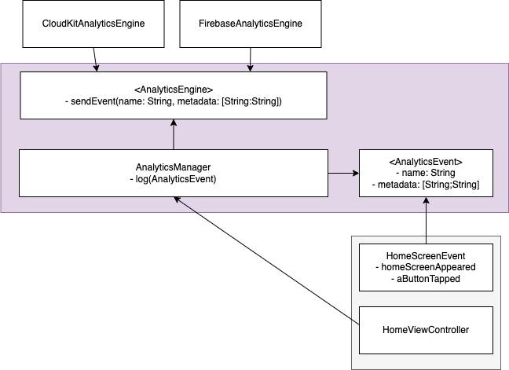

# clean-analytics-architecture-ios
This project implements the analytics system described in Sundell's post [Building an enum-based analytics system in Swift](https://www.swiftbysundell.com/articles/building-an-enum-based-analytics-system-in-swift/). Using enum to manage events will eventually become messy when the number of events grows to hundreds. Therefore, I will have used structure instead of enum to better manage events, when it needs to refactor. Since events are added, modified, deleted frequently, there is a high possibility to automate the process of generating events. Keep the events-related code simple.

## Architecture

The analytic system contains AnalyticsManager, that has dependencies to AnalyticsEngine and AnalyticsEvent protocols. You may add a new analytics engine that conforms the AnalyticsEngine protocol anytime into this analytics system. AnalyticsManager can send event logs to all the analytics engines. You may add events by UI screen or using any naming conventions to get organized. The HomeViewController has a dependency to AnalyticsManager, when it needs to log events.
